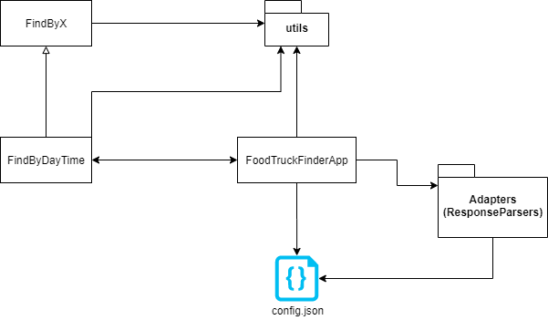
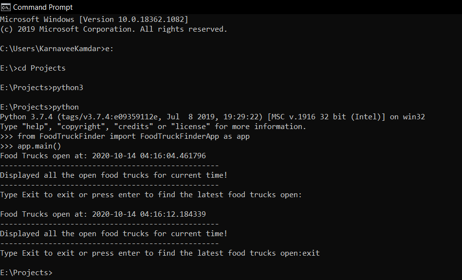

# About the FoodTruckFinder App:
The design of the FoodTruckFinder app to display all the open food trucks (alphabetically by food truck name) at the day and time of execution is as follows:
Based on my study of the Socrata API and its data, the following breakdown of the sample request provides the desired results:
`"https://data.sfgov.org/resource/jjew-r69b.json?dayorder=4&$where=start24 between '00:00' and '16:00' and end24 between '17:00' and '24:00'&$select=distinct applicant,location&$order=applicant&$limit=1000"
`

Where
* dayorder is 0 for Sunday, 1 for Monday and so on…
* applicant is the Food Truck Name, 
* location is the location of food truck
* start24 and end24 is hours information in 24 hours format

Since this program is designed to run on a local machine of the user and display open trucks, the implementation is configured to consider the memory limitations of the system by limiting the number of records returned by API by specifying the return limit in config.json file. 
As per the requirements, we only need to display 10 food trucks or less (if less than 10) per page, therefore, I am getting the API response by limiting the number of records returned by say 1000 and then iterating over the response and displaying it in batch of 10 records with food truck name and location information. Once a batch of 10 records is loaded, the program waits for some user input (or just press enter event) before displaying next batch of records. 

One of the things that I observed from the data was that start and end time was “hour of the day” focused i.e. the minutes part wasn’t relevant. Therefore, in my implementation, I am only considering the hour portion and not minutes when querying the API. Also, to avoid repetitive calls to the API, I am using LRU Caching and setting the capacity as maxsize=1 and passing query string and today’s date as parameters to the cached function. The date parameter passed to this function plays no role unless you execute this program on someday say, Monday at 4 pm and the complete response is loaded and stored in your cache and after the completion, you don’t close the program and the system, request the data again next week on the same day and time. Under that case, the API will be called and you will get fresh data, not a week-old cache data. Likewise, considering only the hour portion when requesting the API and neglecting the minutes, reduces all the number of calls possible in an hour by the user.

In case of new food trucks getting added to the data source, it will at max undergo a 1-hour delay before it appears in the users feed that has cached data. This approach works since we want to know all the open food trucks at the moment. If we only needed to know which all food trucks are open at the moment and in next 30 mins or X hours, we can easily implement and integrate a separate functionalion to achieve the same without modifying the above implementation of the method. The program uses few basic utility functions to efficiently maintain and ensure that any specific changes, for instance, change in date format imposed by the Socrata API, the program only needs to perform changes at one place and wherever else it is used, the changes are reflected and accommodated.

Here is a brief overview of code files interaction:
 

The implementation of this app is fairly simple, documented, easy to maintain and open for extension.

# How to run the Program:

1. Download and rename `FoodTruckFinder.zip123` to `FoodTruckFinder.zip` 

2. Unzip `FoodTruckFinder.zip` to Desktop as `FoodTruckFinder`

3. Run the following from **outside** of the `FoodTruckFinder` folder
i.e. after you downloading and extracting the FoodTruckFinder on Desktop, run the following commands from Desktop in terminal.

4. Open terminal and navigate to Desktop

5. Check and use python 3 version and create virtual environment using the following command: 
`python --version` or 
`python3 --version`

    Say if python3 enables you to access python version 3 onwards, use and execute the following command:
    
    (In ubuntu or debian may require to run:
    `sudo apt-get install python3-venv`)
    
    `python3 -m venv new_venv`     

    `source new_venv/bin/activate` 
        
6. Once in (new-venv), execute the following commands:

    `pip3 install -r FoodTruckFinder/requirements.txt`  

    (or pip based on your system setup)

    `python3`    
    `from FoodTruckFinder import FoodTruckFinderApp as app`     
    `app.main()`
     
That's it! (Tested on Windows and Ubuntu)     

# Output:

When no data is returned from the API:

Data returned from API for the Food Trucks open on Friday 9:21 pm:

# Future Work:
Include authentication and use of API token to overcome limitations of throttling, implement detailed error logging and  handling functionalities for ease of debugging. Include support for other APIs. Explore ways to improve performance.